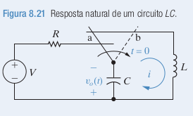
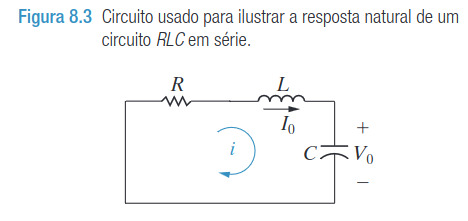
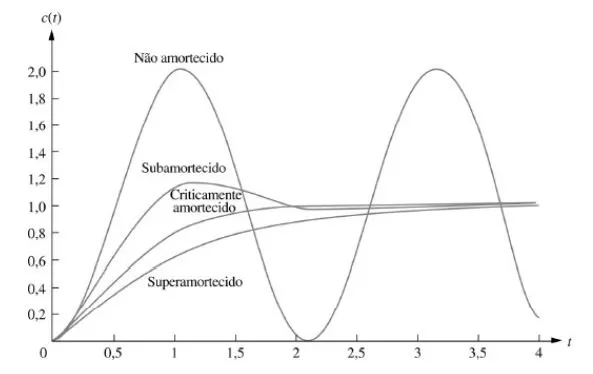
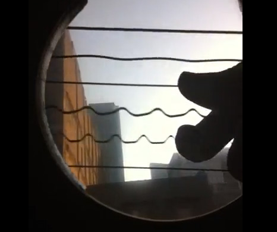
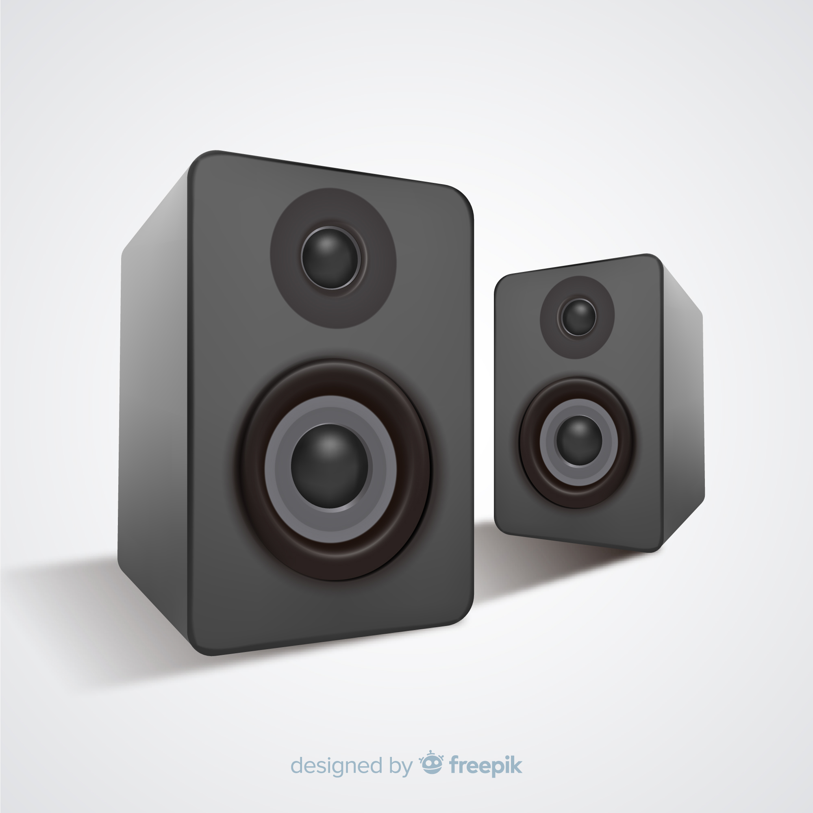
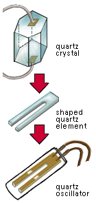

# Análise de Circuitos Elétricos
## Sincronização do relógio de um computador.
 
Anielly Gonçalves
César Henrique Resende Soares
Emanuel Vieira Tavares
Vinícius Alves Pereira

CEFET-MG - Divinópolis, 2023.

---

## Introdução

Observando o circuito presenta na figura 8.21, temos que:

Quando $t > 0$, comportamento desse circuito se parece com o comportamento do circuito presente na figura 8.3, mas sem o resistor, que representa uma resposta natural de um circuito RLC em série.

---

## Introdução

Analisando esse circuito LC, podemos ver que a sua saída
é uma senoide não amortecida.

Dessa forma, podemos utilizar esse circuito como base para medir o tempo? Por que os computadores utilizam osciladores de quartzo?

Sabendo que podemos  especificar a frequência do sinal selecionando os valores apropriados para o indutor e o capacitor, podemos criar uma senoide da forma que a gente precise.

---

## Teoria

Comece escrevendo a equação LTK para o circuito da Figura 8.21, utilizando a corrente $t$, para $t \geq 0$ :
$$
L \frac{d i(t)}{d t}+\frac{1}{C} \int_0^t i(x) d x=0 .
$$

Para eliminar o termo integral, derive ambos os lados com relação a $i$ para obter
$$
L \frac{d^2 i(t)}{d t^2}+\frac{1}{C} i(t)=0 .
$$

A equação diferencial descrita é, portanto,
$$
\frac{d^2 i(t)}{d t^2}+\frac{1}{L C} i(t)=0 .
$$

---

## Teoria

Qual função matemática podemos adicionar à sua segunda derivada para chegarmos a zero? Uma senoide na forma $i(t)=$ $A \cos \omega_0 t$ vai funcionar:
$$
\frac{d^2}{d t^2} A \cos \omega_0 t+\frac{1}{L C} A \cos \omega_0 t=-\omega_0^2 A \cos \omega_0 t+\frac{1}{L C} A \cos \omega_0 t=0
$$

Essa equação é satisfeita quando
$$
\omega_0^2=\frac{1}{L C} \quad \text { ou quando } \quad \omega_0=\sqrt{\frac{1}{L C}} .
$$

---

## Teoria

A frequência $\omega_0$ é a frequência angular de ressonância conhecida dos circuitos $R L C$, tanto em série quanto em paralelo, cujas unidades são radianos/segundo. Note-se que o circuito $L C$ não tem uma frequência de Neper, $\alpha$.
Escolhemos o valor de $A$ para satisfazer a condição inicial para a corrente no indutor:
$$
i(0)=A \cos \omega_0(0)=\frac{V}{R} \quad  \text{logo} \quad A=\frac{V}{R} .
$$

Portanto, a corrente para o circuito da Figura 8.21 é
$$
i(t)=\frac{V}{R} \cos \omega_0(t), \text { em que } \omega_0=\sqrt{\frac{1}{L C}} .
$$

---

## Teoria

Podemos agora usar a expressão para a corrente no circuito de modo a encontrar a tensão do capacitor:
$$
v_C(t)=\frac{1}{C} \int_0^t i(x) d x=\frac{1}{C} \int_0^t \frac{V}{R} \cos \omega_0 x d x=\frac{V}{\omega_0 R C} \operatorname{sen} \omega_0 t
$$
Ao escolher valores para $L$ e $C$, podemos usar o circuito na Figura 8.21 para gerar uma senoide não amortecida, quando $t \geq 0$, para o gerador do relógio de um computador.

---

## Perspectiva Prática

Agora, com a explicação dada, por que um cristal de quartzo é utilizado para gerar a senoide do gerador de clock em vez do circuito mostrado anteriormente?

Precisamos lembrar que, ao analisar o circuito, pensamos apenas no caso de um capacitor e indutores ideais, algo que não é possível obter na realidade.

No mundo real, indutores e capacitores apresentam uma pequena resistência, e quanto mais tempo passa, mais desfigurada a onda fica, pois parte da energia do circuito é dissipada pela resistência do indutor e do capacitor.

---

## Perspectiva Prática

Mas como cristais de quartzo funcionam?

Todo objeto vibra a alguma frequência quando batemos neles.

---

## Perspectiva Prática

### Efeito piezelétrico:

Resumidamente, algumas substâncias, quando submetidos a uma certa força mecânica, produzem eletricidade devido a mudança de posição das cargas dentro de sua extrutura cristalina, um exemplo disso é a cerâmica, que em um microfone, por exemplo, que ao receber ondas mecânicas (voz), consegue criar sinais elétricos, dessa forma captando a voz.

---

## Perspectiva Prática

Também é possível fazer o contrário, se estimularmos eletricamente a cerâmica, por exemplo, ela irá se deformar, dessa forma, vibrando, dessa forma, possibilitando a criação de fones. 

---

## Perspectiva Prática

O cristal de quartzo funciona da seguinte forma: ao receber energia de forma contínua, como em um circuito RTC alimentado por uma bateria de lítio, ele vibra em uma determinada frequência. Essa frequência varia de acordo com a corrente aplicada, e é essa característica que define a frequência que chamamos de clock.

---

# Referência Bibliográfica

- RIEDEL, SUSAN A.; NILSSON, James W. — Circuitos Elétricos 10ª ed. 2015
- Braga, Newton C.Os Cristais de Quartzo, 2021. Disponível em: https://www.newtoncbraga.com.br/index.php/como-funciona/19341-os-cristais-de-quartzo-art4448.html
Acesso em: 21 nov. 2023.
